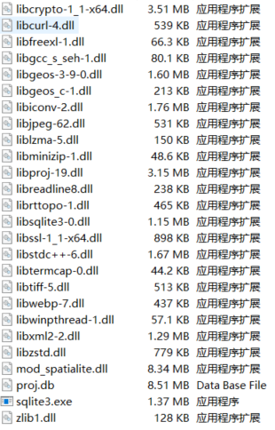
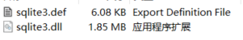
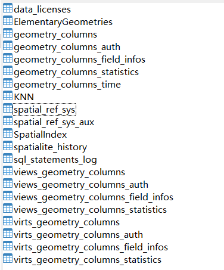
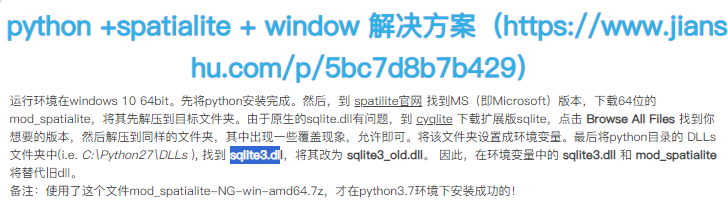

因为工作原因，接触GIS数据比较多。最近项目需要存储GIS网络数据，通常解决方案是安装PostgreSQL，也就是我们常说的PG数据库。但是PG数据库比较大，部署比较麻烦，对于小型项目，实在有点大材小用。而sqlite3最新的扩展插件也支持空间型数据库存储，且sqlite数据库，小巧，很方便和项目一起打包。
以下是对sqlite插件SpatiaLite的主要介绍及常用案例
spatiaLite是一个开源的空间数据库扩展，它为SQLite数据库提供了空间数据的支持。SQLite是一款轻量级的数据库系统，以其简单、稳定和跨平台的特性被广泛使用。SpatiaLite通过扩展SQLite的功能，使其能够存储、检索、查询和更新空间数据。
# 1、SpatiaLite安装

1. **安装 SQLite**：SpatiaLite 是 SQLite 的扩展，因此首先需要安装 SQLite。大多数 Linux 发行版的软件仓库中都可以直接安装 SQLite。
2. **安装 SpatiaLite 核心库**：根据你的操作系统，安装 SpatiaLite 的方法可能不同。在 Debian/Ubuntu 系统上，可以使用如下命令安装：
3. **学习和安装**主要参考如下：> [https://www.gaia-gis.it/fossil/libspatialite/index](https://www.gaia-gis.it/fossil/libspatialite/index)

具体安装方法，可详细参考博客：
> [https://www.xl-optim.com/spatialite-and-python-in-2020/](https://www.xl-optim.com/spatialite-and-python-in-2020/)

​
4、windows下，安装和使用SpatiaLite

- 下载mod_spatialite-5.0.1-win-amd64.zip，解压后将解压目录，添加到系统环境变量path下。目录文件如下：> 下载地址：[https://www.gaia-gis.it/gaia-sins/windows-bin-amd64/](https://www.gaia-gis.it/gaia-sins/windows-bin-amd64/)




- 下载sqlite-dll-win64-x64-3320100.zip，并解压。找到Python环境，例如C:\Python37\DLLs，替换之前的SQLite3.dll。目录文件如下：> 下载地址：[https://sqlite.org/download.html](https://sqlite.org/download.html)



# 2、SpatiaLite使用
## 2.2、数据库使用方法
### 2.2.1、连接数据库

```python
import sqlite3
conn = sqlite3.connect('path/to/file')
conn.enable_load_extension(True)
conn.load_extension("mod_spatialite")
conn.execute("""SELECT InitSpatialMetaData();""") #初始化空间元数据， 这一步耗时较长
```
初始化空间数据库以后，会自动创建部分内置表格，具体如下：



### 2.2.2、创建表格

- 在python中执行SQL语言
```python
# 创建表格
sql_string = """
CREATE TABLE  if not exists table_name (infoname  TEXT UNIQUE NOT NULL,
                                   infovalue TEXT
                                  );
"""
conn.execute(sql_string)
```

- SQL语言示例（同的数据库系统可能有不同的语法和功能）
```plsql
CREATE TABLE customers (
  customer_id INT AUTO_INCREMENT,
  first_name VARCHAR(50) NOT NULL,
  last_name VARCHAR(50) NOT NULL,
  email VARCHAR(100),
  phone VARCHAR(15),
  join_date DATE,
  PRIMARY KEY (customer_id)
);


```

- CREATE TABLE customers 表示创建一个名为 customers 的新表。
- customer_id 是一个整型字段，用于唯一标识每个客户。AUTO_INCREMENT 属性意味着每当插入新记录时，这个字段的值会自动递增。
- first_name 和 last_name 是变长字符串字段，分别用来存储客户的名和姓。VARCHAR(50) 表示字段可以存储最多50个字符，NOT NULL 表示这些字段不允许为空。
- email 和 phone 也是变长字符串字段，分别用来存储客户的电子邮件地址和电话号码。这些字段可以为空。
- join_date 是日期字段，用来存储客户加入的日期。
- PRIMARY KEY (customer_id) 表示 customer_id 字段是表的主键，这意味着它的值必须唯一，并且不能为NULL。
### 2.2.3、创建字段并加上条件约束
SQL字段约束是数据库表设计中用来确保数据准确性和可靠性的一种机制。约束可以强制字段满足特定的规则，比如数据类型、非空性、唯一性、外键关系等。以下是一些常用的SQL字段约束：
​

1. **NOT NULL**：确保列不接受NULL值。
```plsql
CREATE TABLE users (
  user_id INT NOT NULL,
  username VARCHAR(50) NOT NULL,
  password VARCHAR(50) NOT NULL
);
```

1. **UNIQUE**：确保列的所有值都是不同的。
```plsql
CREATE TABLE users (
  user_id INT NOT NULL,
  email VARCHAR(100) UNIQUE
);
```

1. **PRIMARY KEY**：是一个特殊的约束，它要求列的值是唯一的，并且不是NULL。通常用于标识表中的每一行。
```plsql
CREATE TABLE users (
  user_id INT PRIMARY KEY,
  username VARCHAR(50)
);
```

1. **FOREIGN KEY**：用于在两个表之间建立链接，并确保引用的数据的完整性。
```plsql
CREATE TABLE orders (
  order_id INT PRIMARY KEY,
  user_id INT,
  FOREIGN KEY (user_id) REFERENCES users(user_id)
);
```

1. **CHECK**：确保列中的所有值满足特定的条件。
```plain
CREATE TABLE products (
    product_id INT PRIMARY KEY,
    price DECIMAL CHECK (price > 0)
);
```

1. **DEFAULT**：当没有为列提供值时，将自动填充一个默认值。
```plsql
CREATE TABLE users (
  user_id INT PRIMARY KEY,
  username VARCHAR(50) NOT NULL,
  last_login TIMESTAMP DEFAULT CURRENT_TIMESTAMP
);
```

1. **AUTO_INCREMENT** 或 **SERIAL**：在插入新行时，自动为列生成一个唯一的数字序列。
```plain
CREATE TABLE users (
    user_id INT AUTO_INCREMENT PRIMARY KEY,
    username VARCHAR(50) NOT NULL
);
```

1. **CASCADING**：通常与FOREIGN KEY一起使用，定义了当主键表中的数据被更新或删除时，外键表中相应数据的行为。
```plain
CREATE TABLE orders (
    order_id INT PRIMARY KEY,
    user_id INT,
    order_date DATE,
    FOREIGN KEY (user_id) REFERENCES users(user_id) ON DELETE CASCADE
);
```

1. **INDEX**：创建索引以加速查询，虽然不是直接作用于字段的约束，但可以提高数据库性能。
```plain
复制
CREATE INDEX idx_lastname ON users(lastname);
```


### 2.2.3、表格插入数据

- 插入数值
```plsql
INSERT INTO table_name (column1, column2, column3, ...)
VALUES (value1, value2, value3, ...);
```

- 插入多行
```plsql
INSERT INTO table_name (column1, column2)
VALUES 
    (value1a, value2a),
    (value1b, value2b),
    (value1c, value2c);
```

- 使用查询结果插入数据
```plsql
INSERT INTO table_name (column1, column2)
SELECT column3, column4
FROM another_table
WHERE some_condition;
```
### 2.2.4、触发器

SQL触发器（Trigger）是一种特殊类型的存储过程，它会自动执行当在表上发生特定事件（如插入（INSERT）、更新（UPDATE）或删除（DELETE）操作）时。触发器可以用来自动化数据完整性检查、自动更新或其他自动化的数据库维护任务。

1. **触发器类型**：触发器可以是BEFORE触发器或AFTER触发器，分别在事件之前或之后触发。
2. **事件**：触发器可以响应的事件包括INSERT、UPDATE、DELETE。
3. **定义触发器**：使用CREATE TRIGGER语句来定义一个新的触发器。
4. **触发器的组成**：触发器由一个触发器名称、事件（INSERT、UPDATE或DELETE）、表名、时机（BEFORE或AFTER）以及触发器定义（通常是一个BEGIN...END块，包含SQL语句）组成。
EX:在INSERT操作之前检查数据

```plsql

CREATE TRIGGER check_age_before_insert
BEFORE INSERT ON customers
FOR EACH ROW
BEGIN
    IF NEW.age < 18 THEN
        SIGNAL SQLSTATE '45000' SET MESSAGE_TEXT = 'You must be at least 18 years old.';
    END IF;
END;
```

# 3、应用示例
功能需求：创建地理空间型数据库，将shpfile网络导入到数据库中；

```plsql
from sqlite3 import Connection, connect
from shapely.geometry import LineString
import geopandas as gpd

if __name__ == "__main__":
# 连接到SQLite数据库，如果不存在则创建
try:
    data =  "./project_database_test3.sqlite"
    conn = connect(data)
    conn.enable_load_extension(True)
    conn.load_extension("mod_spatialite")
    conn.execute("""SELECT InitSpatialMetaData();""")
    print("end init")
    connsor = conn.cursor()
    # 创建表格和字段
    sql_create_table = """
                     CREATE TABLE  if not exists links (
                                                   link_id         INTEGER NOT NULL UNIQUE,
                                                   a_node          INTEGER,
                                                   b_node          INTEGER,
                                                   direction       INTEGER NOT NULL DEFAULT 0,
                                                   length        NUMERIC,
                                                   modes           TEXT    NOT NULL,
                                                   link_type       TEXT    NOT NULL,
                                                   CHECK(TYPEOF(link_id) == 'integer')
                                                   CHECK(TYPEOF(a_node) == 'integer')
                                                   CHECK(TYPEOF(b_node) == 'integer')
                                                   CHECK(TYPEOF(direction) == 'integer')
                                                   CHECK(LENGTH(modes)>0)
                                                   CHECK(LENGTH(direction)==1));

                    """
    connsor.executescript(sql_create_table)
    # 创建地理空间字段
    sql_geometry = """select AddGeometryColumn( 'links', 'geometry', 4326, 'LINESTRING', 'XY', 1);"""

    connsor.executescript(sql_geometry)
    shp_file = r"./links.shp"
    gp_shp = gpd.read_file(shp_file)
    # gp_shp.set_crs("4326")
    lin_geo = gp_shp.geometry[0].wkb
    # print(lin_geo)
    link_dict = [56,0,1,0,1,"c","road",lin_geo] # .wkb
    columns = ["link_id","a_node","b_node","direction","length","modes","link_type"]
    sql_insert = "INSERT INTO {} ({}, geometry) VALUES({}, GeomFromWKB(?, 4326))".format("links", ",".join(columns), ','.join(['?'] * (len(columns))))
    print(columns)
    print(sql_insert)
    connsor.execute(sql_insert,link_dict)
    conn.commit()

    connsor.close()
    conn.close()
except Exception as ex:
    print(ex.args)


```
​
# 注意事项：

- 初始化操作conn.execute("""SELECT InitSpatialMetaData();""")耗时比较长，可以通过预先初始化一个数据库，后续创建其他数据库时，以它为基础，进行复制即可；
- 在执行插入操作以后，别忘记执行conn.commit()，保存执行结果；
- 注意坐标导入过程中的文本转化，shapely自带坐标转文本，Well-Known Text (WKT) ：转化为文本格式和 Well-Known Binary (WKB)：转化为二进制格式。在数据库导入时，分别使用GeomFromText()和GeomFromWKB()；
- 主要坐标系设置，经纬度坐标，投影坐标等；​


