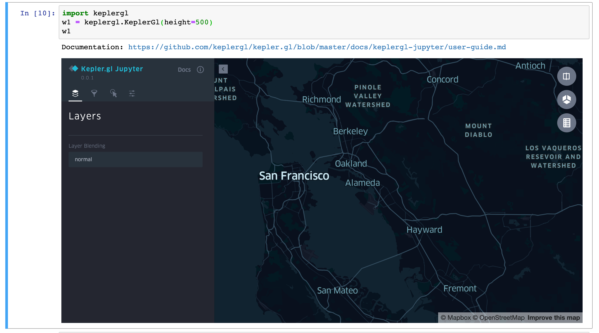
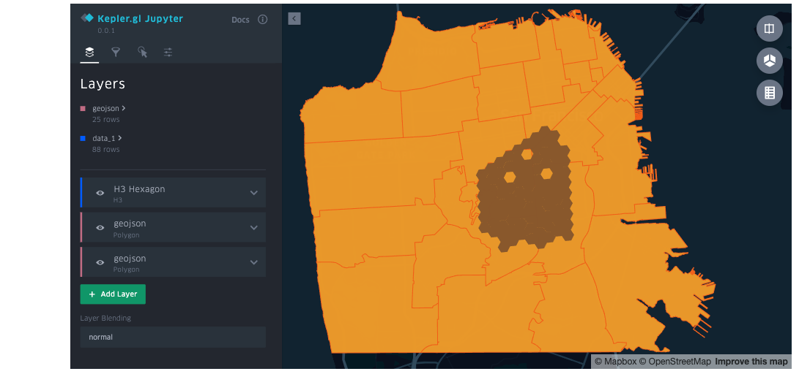

# 1、安装

```python
pip install kaperlgl
```

- 安装前置工作：
- 安装gdal,fino
- 安装geopandas​
# 2、使用
## 2.1、加载empty map

```python
 Load an empty map
from keplergl import KeplerGl
map_1 = KeplerGl()
map_1
```



## 2.2、加载数据

- kepler.gl supports **CSV**, **GeoJSON**, Pandas **DataFrame** or GeoPandas **GeoDataFrame**.
```python
# DataFrame
df = pd.read_csv('hex-data.csv')
map_1.add_data(data=df, name='data_1')

# CSV
with open('csv-data.csv', 'r') as f:
    csvData = f.read()
map_1.add_data(data=csvData, name='data_2')

# GeoJSON as string
with open('sf_zip_geo.json', 'r') as f:
    geojson = f.read()

map_1.add_data(data=geojson, name='geojson')
```


## 2.3、设置

```python
config = {
    'version': 'v1',
    'config': {
        'mapState': {
            'latitude': 37.76209132041332,
            'longitude': -122.42590232651203,
            'zoom': 12.32053899007826
        }
        ...
    }
},
map_1.add_data(data=df, name='data_1')
map_1.config = config
```
## 2.4、数据保存

```python
map_1.save_to_html(file_name='first_map.html')

# this will save map with provided data and config
map_1.save_to_html(data={'data_1': df}, config=config, file_name='first_map.html')

# this will save map with the interaction panel disabled
map_1.save_to_html(file_name='first_map.html', read_only=True)
```
