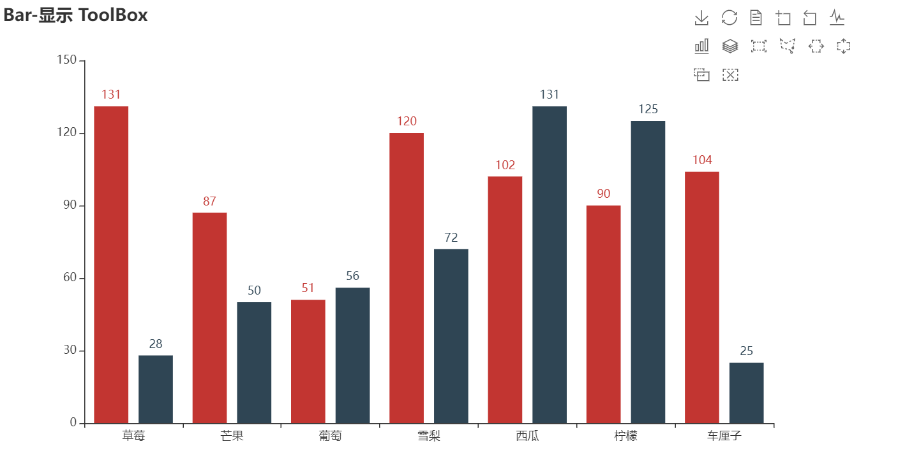

- author:lhy
Echarts是一个由百度开源的商业级数据图表，它是一个纯JavaScript的图表库，可以为用户提供直观生动，可交互，可高度个性化定制的数据可视化图表，赋予了用户对数据进行挖掘整合的能力。pyechart可以理解为python版本的三方包。

## 1、pyechart教程

### 1.1、安装教程


- 安装教程：pip install pyechart
- 官方网站：[https://pyecharts.org/#/](https://pyecharts.org/#/)
- 使用教程：[https://pyecharts.org/#/zh-cn/global_options](https://pyecharts.org/#/zh-cn/global_options)
- demo案例：[https://gallery.pyecharts.org/#/Geo/README](https://gallery.pyecharts.org/#/Geo/README)
### 1.2、主要示例

#### 1.2.1、柱状图


```plain
from pyecharts import options as opts
from pyecharts.charts import Bar
from pyecharts.faker import Faker

c = (
    Bar()
    .add_xaxis(Faker.choose())
    .add_yaxis("商家A", Faker.values())
    .add_yaxis("商家B", Faker.values())
    .set_global_opts(
        title_opts=opts.TitleOpts(title="Bar-显示 ToolBox"),
        toolbox_opts=opts.ToolboxOpts(),
        legend_opts=opts.LegendOpts(is_show=False),
    )
)
c.render_notebook()
```

输出：



