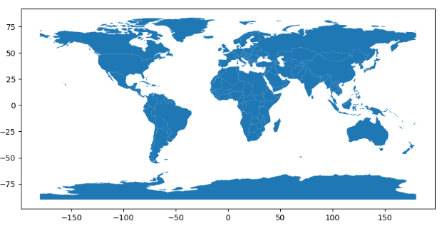
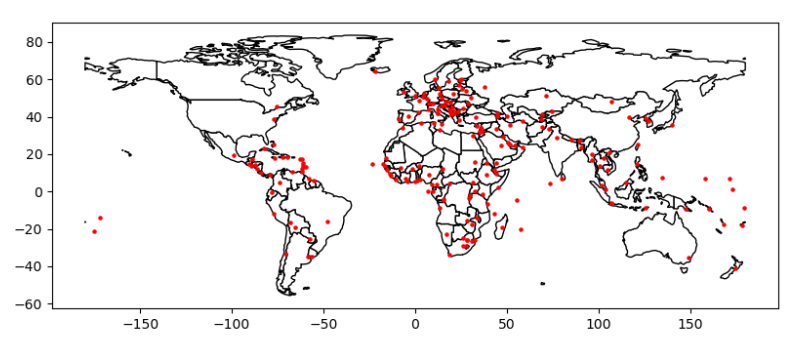
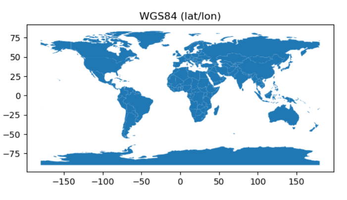
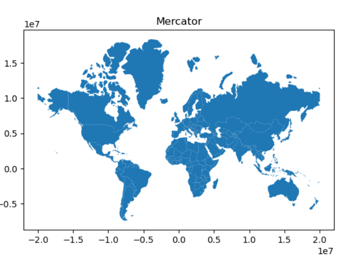
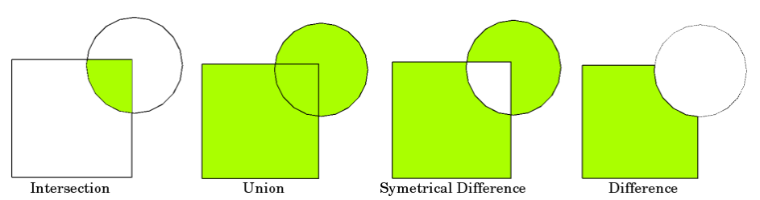

# 1、geopandas基础
GeoPandas是一个基于python的用于地理空间数据分析的开源项目。其数据结构和pandas类似，只不过对其进行了扩展，允许对几何类型进行空间操作。几何运算由shapeely执行，Geopandas进一步依赖fiona进行文件访问，依赖matplotlib进行绘图。
## 1.1、geopandas的安装
geopandas安装
```python
conda install -c conda-forge geopandas
```
geopandas的安装依赖于GDAL,Fiona,pyproj,shapely

- 参考教程：[https://geopandas.org/en/stable/docs/user_guide/interactive_mapping.html](https://geopandas.org/en/stable/docs/user_guide/interactive_mapping.html)
- [https://geopandas.org/en/stable/getting_started/install.html](https://geopandas.org/en/stable/getting_started/install.html)# 2、geopandas使用基础
## 2.1、基础数据类型
1) 主要数据结构有： [GeoSeries](https://geopandas.org/en/stable/docs/reference/api/geopandas.GeoSeries.html#geopandas.GeoSeries) and a [GeoDataFrame](https://geopandas.org/en/stable/docs/reference/api/geopandas.GeoDataFrame.html#geopandas.GeoDataFrame) 和pandas类似，只不过多了一列geometry的shapely对面，描述点，线，面。

```python
world = geopandas.read_file(geopandas.datasets.get_path('naturalearth_lowres'))

world.head()
Out[2]: 
     pop_est  ...                                           geometry
0     920938  ...  MULTIPOLYGON (((180.00000 -16.06713, 180.00000...
1   53950935  ...  POLYGON ((33.90371 -0.95000, 34.07262 -1.05982...
2     603253  ...  POLYGON ((-8.66559 27.65643, -8.66512 27.58948...
3   35623680  ...  MULTIPOLYGON (((-122.84000 49.00000, -122.9742...
4  326625791  ...  MULTIPOLYGON (((-122.84000 49.00000, -120.0000...

[5 rows x 6 columns]

#Plot countries
world.plot();
```


## 2.2、文件读取和保存

```python
geopandas.read_file()
```
写文件：

```python
countries_gdf.to_file("countries.shp")
```
## 2.3、图层展示与叠加

```python
import matplotlib.pyplot as plt

fig, ax = plt.subplots()

# set aspect to equal. This is done automatically
# when using *geopandas* plot on it's own, but not when
# working with pyplot directly.
ax.set_aspect('equal')

world.plot(ax=ax, color='white', edgecolor='black')
Out[36]: <AxesSubplot:>

cities.plot(ax=ax, marker='o', color='red', markersize=5)
Out[37]: <AxesSubplot:>

plt.show();
```

OSM背景图显示：

```python
shp_file.explore()
```
## 2.4、坐标参考系统
坐标参考系统(CRS)很重要，因为GeoSeries或GeoDataFrame对象中的几何形状只是任意空间中的坐标集合。CRS告诉Python这些坐标与地球上的位置之间的关系。
**1）常见的坐标参考系统**：

- WGS84 Latitude/Longitude: "EPSG:4326"
- UTM Zones (North): "EPSG:32633"
- UTM Zones (South): "EPSG:32733"**2）坐标系设置：**

```python
my_geoseries = my_geoseries.set_crs("EPSG:4326")
my_geoseries = my_geoseries.set_crs(epsg=4326)
```
**3) 坐标重投影**
重投影是将位置的表示从一个坐标系变换到另一个坐标系的过程。地球上位置的所有投影到一个二维平面上都是扭曲的，最适合您的应用程序的投影可能与与您导入的数据相关的投影不同。在这些情况下，可以使用**GeoDataFrame.to_crs()**命令重新映射数据:

```python
world = geopandas.read_file(geopandas.datasets.get_path('naturalearth_lowres'))

# Check original projection
# (it's Plate Carrée! x-y are long and lat)
world.crs
Out[2]: 
<Geographic 2D CRS: EPSG:4326>
Name: WGS 84
Axis Info [ellipsoidal]:
- Lat[north]: Geodetic latitude (degree)
- Lon[east]: Geodetic longitude (degree)
Area of Use:
- name: World.
- bounds: (-180.0, -90.0, 180.0, 90.0)
Datum: World Geodetic System 1984 ensemble
- Ellipsoid: WGS 84
- Prime Meridian: Greenwich

# Visualize
ax = world.plot()

ax.set_title("WGS84 (lat/lon)");

# Reproject to Mercator (after dropping Antartica)
world = world[(world.name != "Antarctica") & (world.name != "Fr. S. Antarctic Lands")]

world = world.to_crs("EPSG:3395") # world.to_crs(epsg=3395) would also work

ax = world.plot()

ax.set_title("Mercator");
```




# 3、空间几何操作
## 3.1、常规操作

```python
GeoSeries.buffer(distance, resolution=16)
# Returns a GeoSeries of geometries representing all points within a given distance of each geometric object.

GeoSeries.boundary
Returns a GeoSeries of lower dimensional objects representing each geometries’s set-theoretic boundary.

GeoSeries.centroid
Returns a GeoSeries of points for each geometric centroid.

GeoSeries.convex_hull
Returns a GeoSeries of geometries representing the smallest convex Polygon containing all the points in each object unless the number of points in the object is less than three. For two points, the convex hull collapses to a LineString; for 1, a Point.

GeoSeries.envelope
Returns a GeoSeries of geometries representing the point or smallest rectangular polygon (with sides parallel to the coordinate axes) that contains each object.

GeoSeries.simplify(tolerance, preserve_topology=True)
Returns a GeoSeries containing a simplified representation of each object.

GeoSeries.unary_union
Return a geometry containing the union of all geometries in the GeoSeries.
```
## 3.2、仿射变换

```python
GeoSeries.affine_transform(self, matrix)
Transform the geometries of the GeoSeries using an affine transformation matrix

GeoSeries.rotate(self, angle, origin='center', use_radians=False)
Rotate the coordinates of the GeoSeries.

GeoSeries.scale(self, xfact=1.0, yfact=1.0, zfact=1.0, origin='center')
Scale the geometries of the GeoSeries along each (x, y, z) dimensio.

GeoSeries.skew(self, angle, origin='center', use_radians=False)
Shear/Skew the geometries of the GeoSeries by angles along x and y dimensions.

GeoSeries.translate(self, xoff=0.0, yoff=0.0, zoff=0.0)
Shift the coordinates of the GeoSeries.
```
# 4、重叠集合操作
当使用多个空间数据集时——特别是多个多边形或线数据集——用户通常希望根据这些数据集重叠(或不重叠)的位置创建新的形状。这些操作通常使用集合语言——交集、并和差。这些类型的操作可以通过overlay()方法在geopandas库中使用。



```python
from shapely.geometry import Polygon

polys1 = geopandas.GeoSeries([Polygon([(0,0), (2,0), (2,2), (0,2)]),
                              Polygon([(2,2), (4,2), (4,4), (2,4)])])


polys2 = geopandas.GeoSeries([Polygon([(1,1), (3,1), (3,3), (1,3)]),
                              Polygon([(3,3), (5,3), (5,5), (3,5)])])


df1 = geopandas.GeoDataFrame({'geometry': polys1, 'df1':[1,2]})

df2 = geopandas.GeoDataFrame({'geometry': polys2, 'df2':[1,2]})

ax = df1.plot(color='red');

df2.plot(ax=ax, color='green', alpha=0.5);
```
​
## 4.1、集合操作：

```python
res_union = df1.overlay(df2, how='union')
```

- how="union"
- how="intersection"
- how="symmetric_difference"
- how="difference"
- how="identily"
# 5、空间聚合操作
## 5.1、空间合并
对于非空间数据，我们使用groupby()函数聚合数据。但对于空间数据，在聚合几何特征时，可以使用dissolve()函数聚合几何特征。
安属性列的值做空间合并
```python
world = geopandas.read_file(geopandas.datasets.get_path('naturalearth_lowres'))

world = world[['continent', 'geometry']]

continents = world.dissolve(by='continent')

continents.plot()
```
## 5.2、空间连接
在geopandas中有两种方法组合数据集—属性连接和空间连接。
### 5.2.1、Appending：对行进行拼接
附加GeoDataFrame和GeoSeries使用append()方法。请记住，附加的几何列需要具有相同的CRS

```python
joined = world.geometry.append(cities.geometry)

# Appending GeoDataFrames
europe = world[world.continent == 'Europe']

asia = world[world.continent == 'Asia']

eurasia = europe.append(asia)
```
### 5.2.2、Attribute Joins：属性合并

```python
# `country_shapes` is GeoDataFrame with country shapes and iso codes
country_shapes.head()
Out[11]: 
                                            geometry iso_a3
0  MULTIPOLYGON (((180.00000 -16.06713, 180.00000...    FJI
1  POLYGON ((33.90371 -0.95000, 34.07262 -1.05982...    TZA
2  POLYGON ((-8.66559 27.65643, -8.66512 27.58948...    ESH
3  MULTIPOLYGON (((-122.84000 49.00000, -122.9742...    CAN
4  MULTIPOLYGON (((-122.84000 49.00000, -120.0000...    USA

# `country_names` is DataFrame with country names and iso codes
country_names.head()
Out[12]: 
                       name iso_a3
0                      Fiji    FJI
1                  Tanzania    TZA
2                 W. Sahara    ESH
3                    Canada    CAN
4  United States of America    USA

# Merge with `merge` method on shared variable (iso codes):
country_shapes = country_shapes.merge(country_names, on='iso_a3')

country_shapes.head()
Out[14]: 
                                            geometry  ...                      name
0  MULTIPOLYGON (((180.00000 -16.06713, 180.00000...  ...                      Fiji
1  POLYGON ((33.90371 -0.95000, 34.07262 -1.05982...  ...                  Tanzania
2  POLYGON ((-8.66559 27.65643, -8.66512 27.58948...  ...                 W. Sahara
3  MULTIPOLYGON (((-122.84000 49.00000, -122.9742...  ...                    Canada
4  MULTIPOLYGON (((-122.84000 49.00000, -120.0000...  ...  United States of America

[5 rows x 3 columns]
```
### 5.2.3、Spatial Joins:根据空间关系合并

- [GeoDataFrame.sjoin()](https://geopandas.org/en/stable/docs/reference/api/geopandas.GeoDataFrame.sjoin.html#geopandas.GeoDataFrame.sjoin): joins based on binary predicates (intersects, contains, etc.)       - 有两个核心参数: how and predicate.

- [GeoDataFrame.sjoin_nearest()](https://geopandas.org/en/stable/docs/reference/api/geopandas.GeoDataFrame.sjoin_nearest.html#geopandas.GeoDataFrame.sjoin_nearest): joins based on proximity, with the ability to set a maximum search radius. 

```python
world = gpd.read_file(gpd.datasets.get_path('naturalearth_lowres'))
cities = gpd.read_file(gpd.datasets.get_path('naturalearth_cities'))
countries = world[['geometry', 'name']]

cities_with_country = cities.sjoin(countries, how="inner", predicate='intersects')
```
**predicate参数选项**

- intersects
- contains
- within
- touches
- crosses
- overlaps